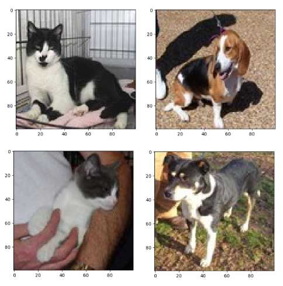
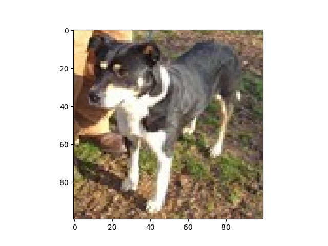
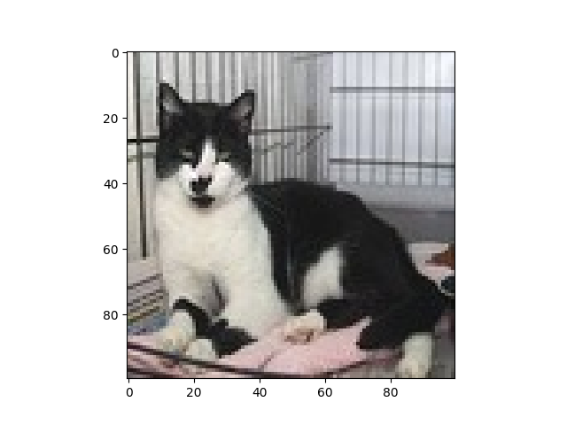
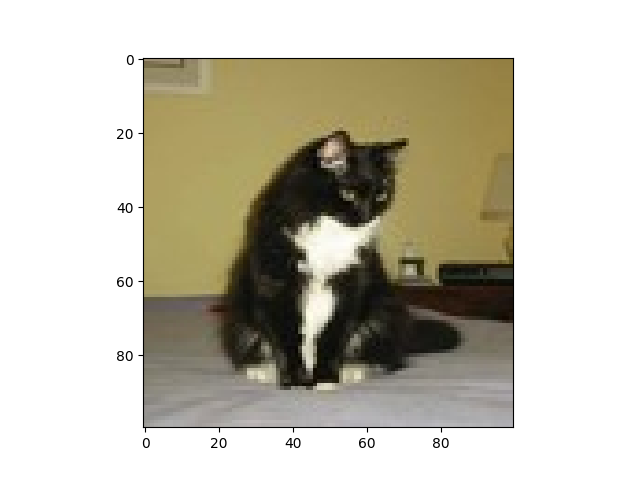
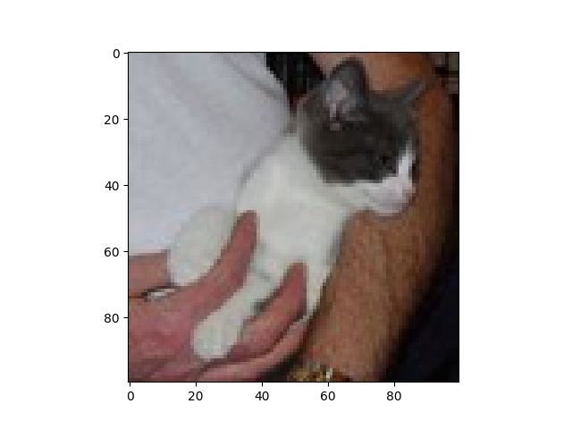
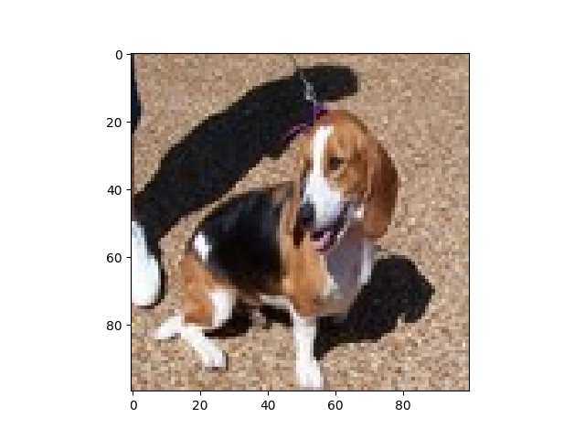

# Image Classification CNN

Train a model from a dataset for predicting **cat** and **dog** from image.



#### Training

```
Epoch 1/5
32/32 [==============================] - 7s 199ms/step - loss: 0.6948 - accuracy: 0.5310
Epoch 2/5
32/32 [==============================] - 6s 200ms/step - loss: 0.6518 - accuracy: 0.6170
Epoch 3/5
32/32 [==============================] - 7s 207ms/step - loss: 0.5855 - accuracy: 0.6830
Epoch 4/5
32/32 [==============================] - 7s 217ms/step - loss: 0.5096 - accuracy: 0.7505
Epoch 5/5
32/32 [==============================] - 7s 229ms/step - loss: 0.4456 - accuracy: 0.7940
13/13 [==============================] - 0s 26ms/step - loss: 0.6087 - accuracy: 0.6925
```

## Using

```
$ python app.py
```

### Demo CNN Model

| Image1 | Label1 | Predict1 | Image2 | Label2 | Predict2 |
| --------------------- | ------------ | ------------ | --------------------- | ------------ | ------------ |
|  |  DOG | DOG |  | CAT | CAT |
|  | CAT | DOG |  | CAT | CAT |
|  | DOG | DOG | | | |

## Sources

- https://drive.google.com/drive/u/0/folders/1dZvL1gi5QLwOGrfdn9XEsi4EnXx535bD
- https://keras.io/api/losses/
